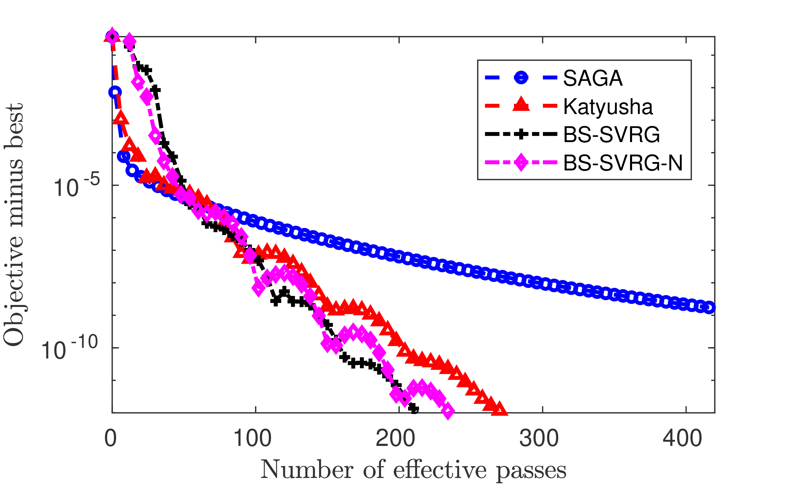

# Demo for BS-SVRG

A demo for SVRG Boosted by Shifting Objective (BS-SVRG) proposed in "Boosting First-order Methods by Shifting Objective: New Schemes with Faster Worst-Case Rates", Kaiwen Zhou, Anthony Man-Cho So and James Cheng, NeurIPS2020 [arXiv](https://arxiv.org/pdf/2005.12061.pdf).

## Usage

All algorithms are implemented in C++.

To run the demo in MATLAB, first run `mex_all` in the MATLAB terminal to generate the mex file. (Note that the compiler should support at least `c++11`)

Then, run `TEST` in the MATLAB terminal, a small demo training $\ell 2$-logistic regression $(\mu=5\times 10^{-8})$ using dataset `a9a` from [LIBSVM Data](https://www.csie.ntu.edu.tw/~cjlin/libsvmtools/datasets/), to generate a plot shown as below.

Test environment: HP Z440 machine with single Intel Xeon E5-1630v4 with 3.70GHz cores, 16GB RAM, Ubuntu 18.04 LTS with GCC 4.8.0, MATLAB R2017b.

```bash
>> TEST
Building with 'g++'.
MEX completed successfully.
Model: L2-logistic
Algorithm: SAGA
Time: 11.582018 seconds
Algorithm: Katyusha
Time: 15.778917 seconds
Algorithm: BS_SVRG
Time: 8.186314 seconds
Algorithm: BS_SVRG
Time: 8.189970 seconds
```


